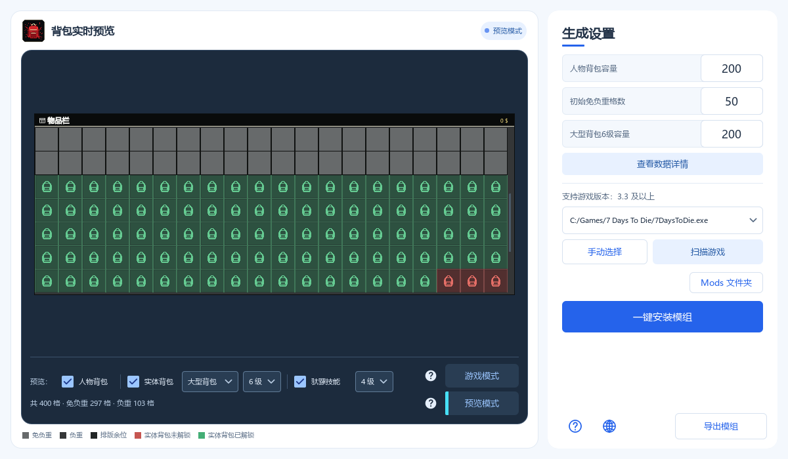
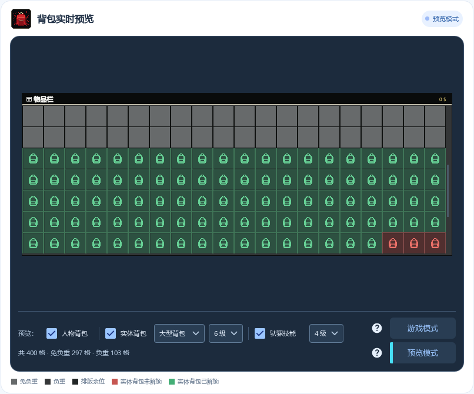
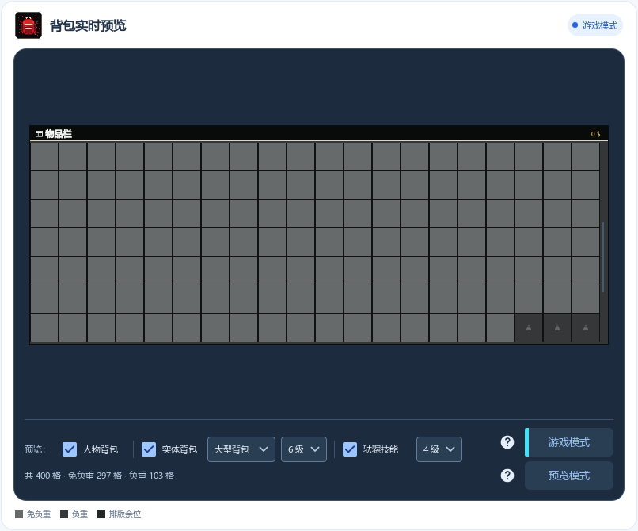
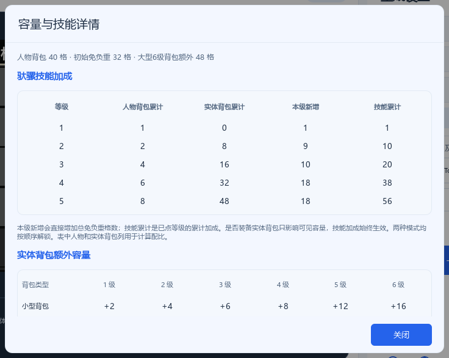
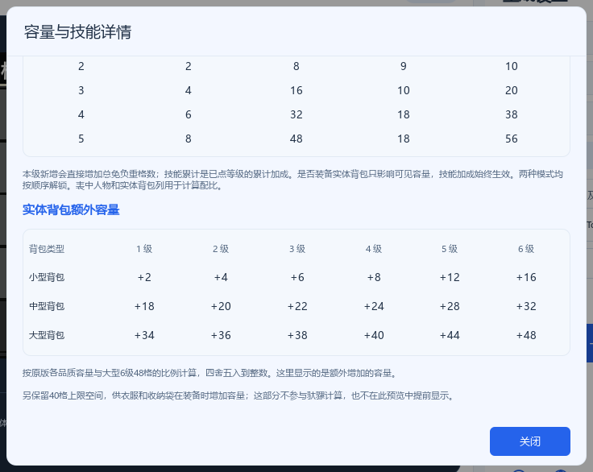
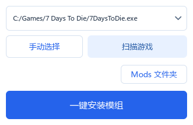
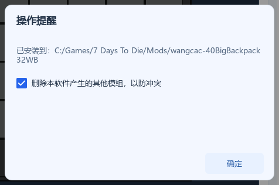

**简体中文** | [English](README_EN.md)

[更新日志](CHANGELOG.md)

<div align="center">
  


  <h1>七日杀自定义背包容量工具</h1>

  <p>自定义人物和实体背包容量，预览装备与驮骡技能的效果，然后一键生成并安装模组。</p>
  <p><strong>v1.3.0</strong> · Windows · 适配《七日杀》V3.3 及以上版本</p>

  <p>
    <a href="#项目介绍">项目介绍</a> ·
    <a href="#功能亮点">功能亮点</a> ·
    <a href="#快速开始">快速开始</a> ·
    <a href="#从源码构建">从源码构建</a> ·
    <a href="#反馈与贡献">反馈与贡献</a>
  </p>
</div>



*上图为示例配置，可按自己的玩法调整容量。*

## 项目介绍

背包模组几乎是许多《七日杀》玩家的必备项，但游戏更新后重新寻找、下载和安装合适的模组很费时间；现成模组的容量配置也未必符合每个人的需求。

这个工具把配置、预览和安装放在一起：设置人物背包容量、初始免负重格数和实体背包容量，再选择背包类型、等级与「驮骡」技能等级，就能提前查看效果。确认配置后，可以一键安装到游戏的 `Mods` 文件夹，也可以导出 ZIP 与朋友分享。

## 功能亮点

- **自由配置**：设置人物背包容量、初始免负重格数和大型 6 级实体背包容量，其他背包类型与等级会一起调整。
- **实时预览**：选择背包类型、等级和「驮骡」技能等级，提前查看可用格数与负重区域，无需反复启动游戏。
- **两种查看方式**：游戏模式模拟游戏中的实际显示；预览模式用标记清楚显示实体背包增加的容量。
- **数据详情**：一处查看各等级驮骡加成，以及小型、中型、大型背包各等级增加的格数。
- **大容量拾取**：死亡掉落背包支持滚动查看物品，改善大容量背包界面超出屏幕的问题。
- **定位游戏**：可以自动定位游戏本体，多个游戏路径会保存在下拉框中，供下次启动使用。
- **一键安装**：安装时可清理本工具生成的旧背包模组，减少换配置后的冲突。
- **导出分享**：将模组连同顶层模组文件夹导出为 ZIP，方便备份或分享。
- **双语界面**：提供简体中文和英语，初次启动时根据系统语言选择。

## 快速开始

### 获取程序

从 [最新 Release](https://github.com/WangCAC/7-Days-Backpack-Tools/releases/latest) 下载 Windows 单文件版 `.exe`，运行即可使用。

默认配置为人物背包 **40 格**、初始免负重 **32 格**、大型 6 级实体背包 **48 格**。

### 配置并安装

1. 设置**人物背包容量**、**初始免负重格数**和**大型背包 6 级容量**。其他类型、等级的实体背包容量会自动调整。初始免负重格数不能超过人物背包容量。

   

2. 查看左侧实时预览。在下方勾选**实体背包**和**驮骡技能**，选择背包类型、等级和技能等级，查看对应效果。点击**查看数据详情**可以比较各等级增加的格数。

   | 预览模式：带标记显示实体背包增加的容量 | 游戏模式：模拟游戏中实际看到的效果 |
   | --- | --- |
   |  |  |

   <details>
   <summary>查看数据详情窗口</summary>

   

   

   </details>

3. 点击**扫描游戏**查找游戏安装位置。如果未找到，点击**手动选择**，选择游戏主目录中的 `7DaysToDie.exe`。

   

4. 点击**一键安装模组**。工具会将生成的模组安装到所选游戏的 `Mods` 文件夹；文件夹不存在时会自动创建。

5. 在弹窗中保留勾选**删除本软件产生的其他模组，以防冲突**，然后点击**确定**，即可清理旧配置。若要保留旧配置，可以取消勾选。点击 **Mods 文件夹**可以查看已安装的模组。

   

想把配置分享给别人？点击**导出模组**保存 ZIP。接收者将 ZIP 中的模组文件夹解压到自己游戏目录的 `Mods` 文件夹即可。

## 从源码构建

项目使用 **C++、Qt 6（Qt Quick / QML）和 CMake**。需要 Qt 6.8 或更新版本，以及与 Qt 套件匹配的 C++ 编译器。

最简单的方式是在 Qt Creator 中打开 `CMakeLists.txt`，选择桌面 Qt 套件并构建 Release 版本。也可以在已配置 Qt 环境的终端中执行：

```bash
cmake -S . -B build -DCMAKE_BUILD_TYPE=Release -DCMAKE_PREFIX_PATH=<Qt安装目录>
cmake --build build --config Release
```

直接构建得到的程序仍需随附 Qt 运行库；分发时可使用 Qt 的 `windeployqt` 收集依赖。

## 反馈与贡献

发现问题或有功能建议，欢迎在 [Issues](https://github.com/WangCAC/7-Days-Backpack-Tools/issues) 中说明游戏版本、操作步骤和现象；也欢迎提交 Pull Request。

## 许可与致谢

本项目由 [WangCAC](https://github.com/WangCAC) 开发，采用 [MIT 许可证](LICENSE)。README 的章节组织参考了 [Best-README-Template](https://github.com/othneildrew/Best-README-Template)。
