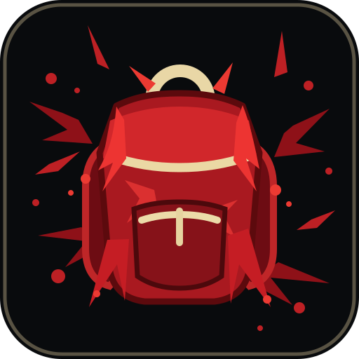
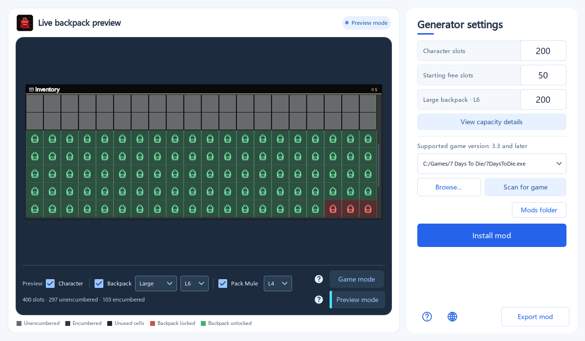
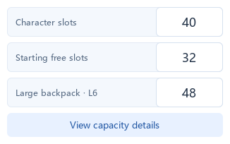
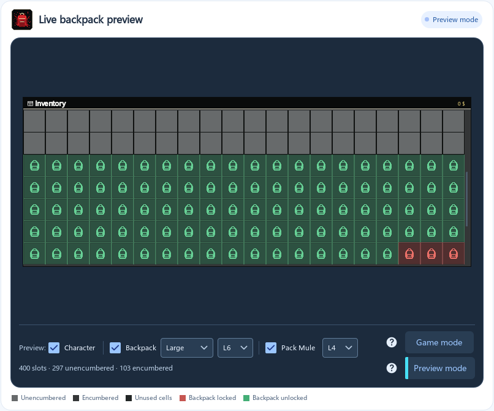
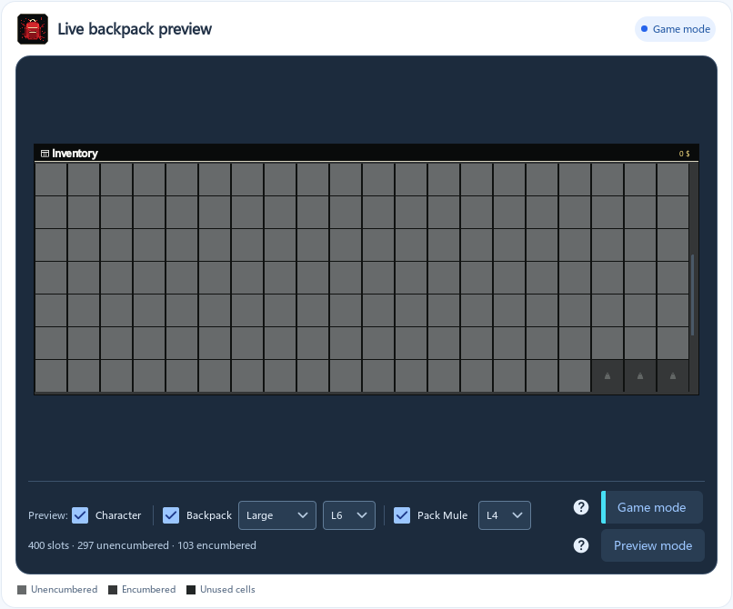
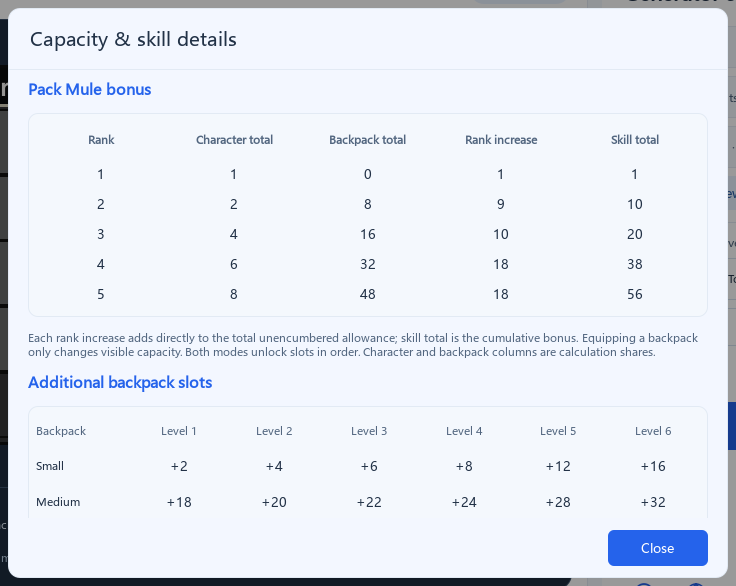
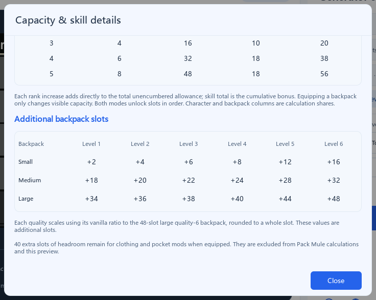
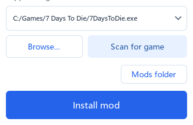
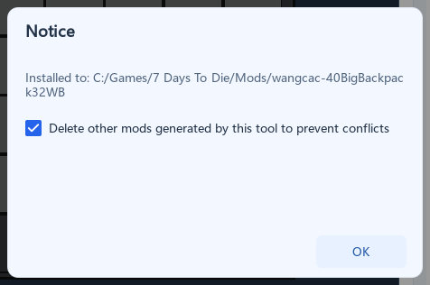

[简体中文](README.md) | **English**

[Changelog](CHANGELOG_EN.md)

<div align="center">
  


  <h1>7 Days to Die Custom Backpack Capacity Tool</h1>

  <p>Customize character and equipped backpack capacity, preview equipment and Pack Mule effects, then generate and install your mod in one click.</p>
  <p><strong>v1.3.0</strong> · Windows · Supports 7 Days to Die V3.3 and later</p>

  <p>
    <a href="#about-the-project">About</a> ·
    <a href="#features">Features</a> ·
    <a href="#quick-start">Quick Start</a> ·
    <a href="#building-from-source">Build from Source</a> ·
    <a href="#feedback-and-contributions">Feedback & Contributions</a>
  </p>
</div>



*The screenshot shows an example setup. Adjust the capacity to suit your playstyle.*

## About the Project

Backpack mods are practically essential for many 7 Days to Die players. But after a game update, finding, downloading, and installing a suitable mod again takes time. Ready-made mods may not offer the capacity settings every player wants.

This tool brings configuration, preview, and installation together. Set character backpack slots, starting unencumbered slots, and equipped backpack capacity, then choose a backpack type, quality, and Pack Mule rank to preview the result. Once you are happy with the setup, install it directly into the game's `Mods` folder or export a ZIP to share with friends.

## Features

- **Flexible configuration**: Set character slots, starting unencumbered slots, and large quality-6 backpack capacity. Other backpack types and qualities adjust with it.
- **Live preview**: Choose a backpack type, quality, and Pack Mule rank to see available slots and encumbered areas without repeatedly launching the game.
- **Two viewing modes**: Game mode simulates the in-game appearance. Preview mode marks the extra slots provided by an equipped backpack.
- **Capacity details**: Compare Pack Mule bonuses and the additional slots provided by every quality of small, medium, and large backpacks in one place.
- **Large death-backpack display**: Scroll through dropped items, reducing problems with oversized backpack windows extending beyond the screen.
- **Find the game**: Automatically locate the game installation. Multiple game paths are saved in the drop-down list for future sessions.
- **One-click installation**: Install a new setup and optionally remove older backpack mods generated by this tool to reduce conflicts.
- **Export and share**: Export the mod, including its top-level mod folder, as a ZIP for backup or sharing.
- **Bilingual interface**: Simplified Chinese and English are available. The initial language follows your system language.

## Quick Start

### Get the App

Download the Windows single-file `.exe` from the [latest release](https://github.com/WangCAC/7-Days-Backpack-Tools/releases/latest) and run it.

The defaults are **40 character slots**, **32 starting unencumbered slots**, and **48 slots for a large quality-6 backpack**.

### Configure and Install

1. Set the **character backpack slots**, **starting unencumbered slots**, and **large quality-6 backpack capacity**. Other backpack types and qualities adjust automatically. Starting unencumbered slots cannot exceed the character backpack capacity.

   

2. Check the live preview on the left. Enable **Backpack** and **Pack Mule** below it, then choose a backpack type, quality, and skill rank to preview their effects. Click **View capacity details** to compare the additional slots at each level.

   | Preview mode: marks the extra slots from an equipped backpack | Game mode: simulates the in-game appearance |
   | --- | --- |
   |  |  |

   <details>
   <summary>See the capacity details window</summary>

   

   

   </details>

3. Click **Scan for game** to find your game installation. If it is not found, click **Browse…** and select `7DaysToDie.exe` in the game directory.

   

4. Click **Install mod**. The tool installs the generated mod into the selected game's `Mods` folder, creating it if necessary.

5. In the dialog, leave **Delete other mods generated by this tool to prevent conflicts** checked to remove older configurations, then click **OK**. Uncheck it if you want to keep the older configurations. Click **Mods folder** to view the installed mod.

   

Want to share your configuration? Click **Export mod** to save a ZIP. The recipient can extract the mod folder from the ZIP into the `Mods` folder of their own game installation.

## Building from Source

The project uses **C++, Qt 6 (Qt Quick / QML), and CMake**. You need Qt 6.8 or later and a C++ compiler compatible with your Qt kit.

The simplest way is to open `CMakeLists.txt` in Qt Creator, choose a desktop Qt kit, and build the Release configuration. You can also run the following in a terminal with Qt configured:

```bash
cmake -S . -B build -DCMAKE_BUILD_TYPE=Release -DCMAKE_PREFIX_PATH=<Qt-installation-directory>
cmake --build build --config Release
```

The executable produced directly by the build still requires Qt runtime libraries. Use Qt's `windeployqt` to collect the dependencies before distribution.

## Feedback and Contributions

If you find a problem or have a feature suggestion, please open an [Issue](https://github.com/WangCAC/7-Days-Backpack-Tools/issues) with your game version, steps to reproduce, and what happened. Pull Requests are also welcome.

## License and Acknowledgments

Developed by [WangCAC](https://github.com/WangCAC) and licensed under the [MIT License](LICENSE). The README section structure was inspired by [Best-README-Template](https://github.com/othneildrew/Best-README-Template).
